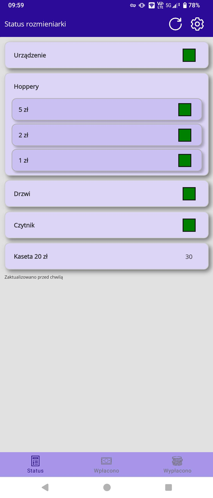
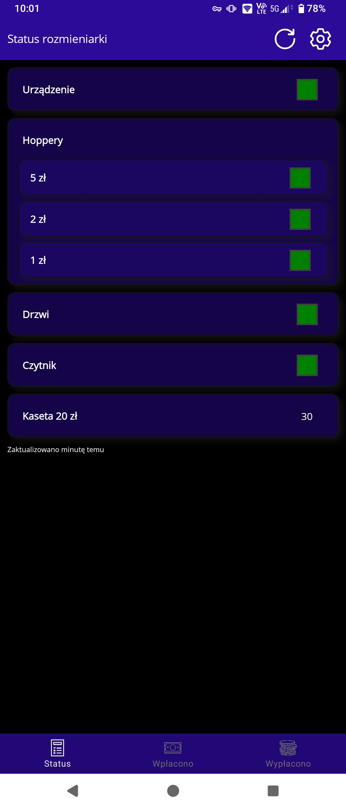
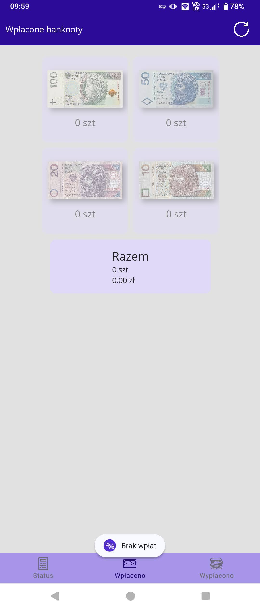
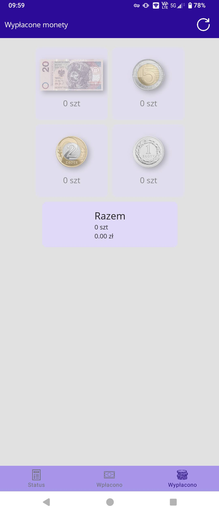
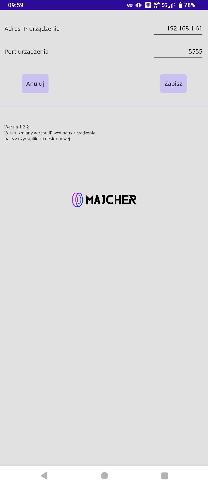

# Rozmieniarka mobile application

Application used to check the status of change machine resources. These include: hoppers full, door status, device status, reader status and the number of banknotes in the hopper

You can also check number of bills and coins withdrawn or inserted and their sum value

## Installation

To install the application, follow these steps:

1. Clone the repository to your local machine.
2. Open the project in Visual Studio
3. Build the project and run the application.

## Requirements

- .NET 7 SDK
- Visual Studio 2022 with .NET Multi-platform App UI development component

## Usage Example

1. Install app on your mobile device
2. On first run in settings page specify IP address and port of your change machine network card
3. Save settings and refresh status page

## Screenshots of user interface

## Supported change machines

[ROZMIENIARKA PIENIĘDZY by Globe Solutions Sp. z o.o](https://www.globesolutions.pl/produkty/rozmieniarka-pieniedzy)

## Contact

If you have any questions or suggestions, please contact me here or at marcel@oponymajcher.pl
